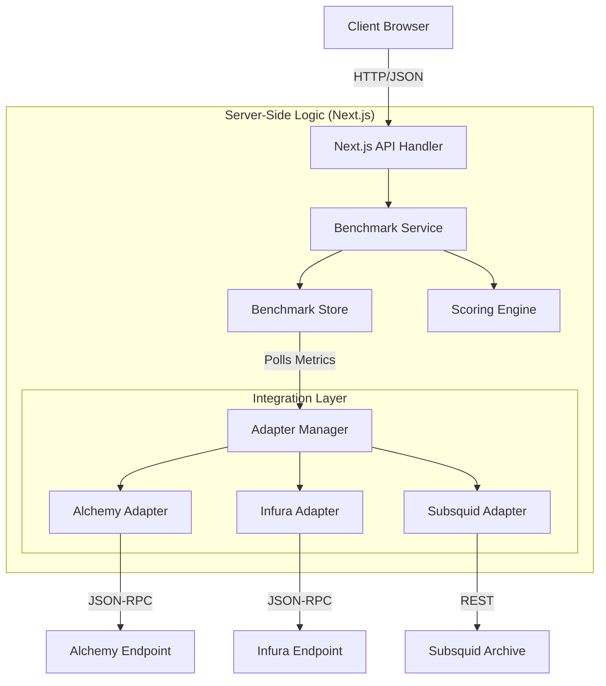

<h1 align="center"># 📊 Benchmarked Dashboard

<div align="center">

[](https://nextjs.org)
[](https://www.typescriptlang.org)
[](https://tailwindcss.com)
[](https://ui.shadcn.com)
[](https://opensource.org/licenses/MIT)

**Real-time Web3 Provider Performance Benchmarks**


[View Demo](https://benchmarked.xyz) · [Report Bug](https://github.com/dinxsh/benchmarked/issues) · [Request Feature](https://github.com/dinxsh/benchmarked/issues)

</div>

---

## 📖 Table of Contents

- [Overview](#-overview)
- [Key Features](#-key-features)
- [Technical Architecture](#-technical-architecture)
  - [System Design](#system-design)
  - [Data Pipeline](#data-pipeline)
  - [Tech Stack](#tech-stack)
- [Getting Started](#-getting-started)
- [Project Structure](#-project-structure)
- [Contributing](#-contributing)
- [License](#-license)

---

## 🚀 Overview

**Benchmarked** is a specialized analytics dashboard designed to bring transparency to Web3 infrastructure. It measures, compares, and visualizes the performance of major RPC providers (Alchemy, Infura, QuickNode, etc.) in real-time.

By leveraging a **Backendless Architecture**, it provides a lightweight yet powerful tool for developers and enterprises to make data-driven decisions about their infrastructure partners.

---

## ✨ Key Features

| Feature | Description |
|---------|-------------|
| **🏆 Leaderboard** | Real-time ranking based on weighted scores of Latency (p50/p95), Uptime, and Error Rates. |
| **📊 Deep Analytics** | Detailed performance profiles with historical trends (24h, 7d, 30d) and distribution breakdowns. |
| **⚔️ Comparison** | Side-by-side "Head-to-Head" mode to compare specific metrics between two providers. |
| **🏢 Workspaces** | Multi-tenant support via Clerk, allowing teams to manage private benchmarks and API keys. |
| **⚡ Real-time** | Automatic polling and score updates ensure data is always fresh. |

---

## 🏗 Technical Architecture

### System Design

The application utilizes a polymorphic adapter pattern to normalize data from disparate provider APIs into a unified scoring engine.



### Data Pipeline

1.  **Ingestion**: The `AdapterManager` schedules polling tasks for each registered provider using their specific `BaseAdapter` implementation.
2.  **Normalization**: Raw responses (latency ms, block height, error codes) are normalized into a standard metric format.
3.  **Scoring**: The `ScoringEngine` applies a weighted algorithm:
    - `Score = (Reliability * 0.4) + (Latency * 0.3) + (DataCorrectness * 0.3)`
4.  **Storage**: Metrics are persisted in `src/lib/benchmark-store.ts` (in-memory/DB) and served via `/api/benchmarks`.

### Tech Stack

- **Framework**: [Next.js 16](https://nextjs.org) (App Router)
- **Styling**: [Tailwind CSS v4](https://tailwindcss.com) & [Shadcn UI](https://ui.shadcn.com)
- **Charts**: [Recharts](https://recharts.org) for high-performance visualization
- **State**: [Zustand](https://github.com/pmndrs/zustand) (Global) & [Nuqs](https://nuqs.47ng.com) (URL-based)
- **Auth**: [Clerk](https://clerk.com) for authentication and organization management

---

## ⚡ Getting Started

### Prerequisites

- **Node.js 18+** or **Bun**
- **Clerk Account** (for authentication keys)

### Installation

1.  **Clone the repository**
    ```bash
    git clone https://github.com/dinxsh/benchmarked.git
    cd benchmarked
    ```

2.  **Install dependencies**
    ```bash
    npm install
    # or
    bun install
    ```

3.  **Configure Environment**
    Create a `.env.local` file:
    ```bash
    cp .env.example .env.local
    ```
    Populate it with your keys:
    ```env
    NEXT_PUBLIC_CLERK_PUBLISHABLE_KEY=pk_test_...
    CLERK_SECRET_KEY=sk_test_...
    
    # Optional: Real Provider Keys
    ALCHEMY_KEY=...
    INFURA_KEY=...
    ```

4.  **Run Development Server**
    ```bash
    npm run dev
    ```
    Visit [http://localhost:3000](http://localhost:3000).

---

## 📂 Project Structure

```plaintext
src/
├── app/                  # Next.js App Router (Pages & API)
│   ├── api/benchmarks/   # Internal API endpoints
│   └── dashboard/        # Main User Interface
├── components/           # Reusable UI Components
├── features/             # Business Logic Modules
│   ├── overview/         # Dashboard Widgets
│   └── compare/          # Comparison Tools
├── lib/                  # Core Libraries
│   ├── adapters/         # Provider API Adapters (The "Brain")
│   └── benchmark-store.ts # Data Persistence Layer
└── config/               # App Constants & Navigation
```

---

## 🤝 Contributing

Contributions make the open-source community an amazing place to learn, inspire, and create. Any contributions you make are **greatly appreciated**.

1.  Fork the Project
2.  Create your Feature Branch (`git checkout -b feature/AmazingFeature`)
3.  Commit your Changes (`git commit -m 'Add some AmazingFeature'`)
4.  Push to the Branch (`git push origin feature/AmazingFeature`)
5.  Open a Pull Request

---

## 📝 License

Distributed under the MIT License. See `LICENSE` for more information.


<!--

SEO keywords:

open source admin dashboard, nextjs admin dashboard, nextjs dashboard template,

shadcn ui dashboard, admin dashboard starter, next.js 16, typescript dashboard,

dashboard ui template, nextjs shadcn admin panel, react admin dashboard,

tailwind css admin dashboard

-->

---


